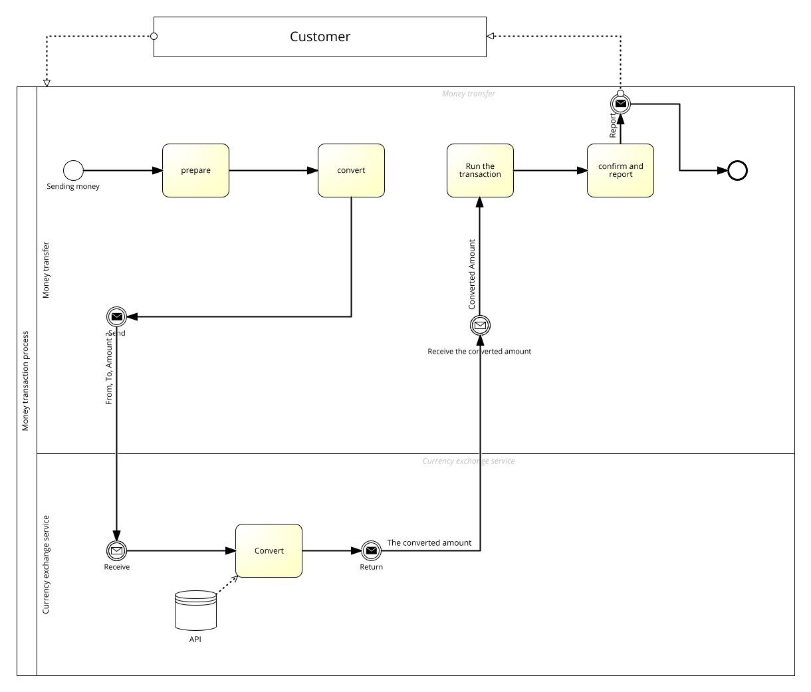

# Währungsumrechnungsservice - Dokumentation

## 1. Prozesssteckbrief

**Name:** Währungsumrechnung im Finanzprozess  
**Ziel:** Automatisierte Umrechnung von Beträgen zwischen verschiedenen Währungen für Finanztransaktionen  
**Beteiligte:** Externe Systeme, Währungsumrechnungsservice, Finanzabteilung  
**Auslöser:** Anfrage einer Umrechnung  
**Ende:** Rückgabe des umgerechneten Betrags

## 2. Prozessbeschreibung

Der Prozess startet, wenn ein Fremdsystem einen Betrag in einer Quellwährung umrechnen möchte. Es sendet eine Anfrage an den Service, der auf Basis aktueller Wechselkurse den Betrag umrechnet und zurückgibt. Das Ergebnis wird weiterverarbeitet.

## 3. Prozessdarstellung (BPMN)

*Abbildung: BPMN-Diagramm zur Währungsumrechnung*

## 5. Integration in den übergeordneten Prozess

Der Service wird von Fremdsystemen genutzt, um Beträge automatisiert und präzise umzuwandeln. Dies optimiert Finanzprozesse, erhöht die Effizienz und reduziert Fehler.

---
